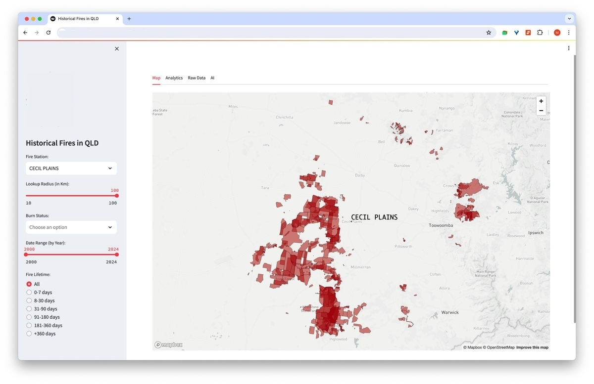

# Demo App for QLD Public Sector Customers

## Introduction

This demo app is a Streamlit app that is used for visualizing and interacting with public data that is available on Snowflake Marketplace. 

The data is provided by The Proptech Cloud, and includes the following datasets:

- Historical fires in the QLD region
- Fire stations in QLD
- Fire brigades in QLD
- Property boundaries in QLD

By combining these datasets, we can answer questions such as:

- How many fires have occurred in certain geographical areas?
- What was the distance between those fires and the nearest fire stations? 
- What fires had the potential to impact more properties?
- Is there a correlation between the age of a fire and its distance from the closest fire station?
- Which fire stations had a high number of fire events in their territory and at what times? 
- etc.

## Deployment Guide

There are multiple steps required for this app to be deployed to Snowflake, which are as follows:

- Creating share databases from Snowflake Marketplace listings
- Creating the underlying datasets (two tables sourced from the publicly available listings)
- Creating a container image repository on Snowflake
- Building the container image locally and pushing it to the created image repository
- Creating the compute pool, network rule and a service from the created container image

### Accessing the Source Data

In order to deploy the app, the first step is to subscribe to the free listings that are published to Snowflake Marketplace. The following is the list of data products used in the app:

- Cadastre - Boundaries & Attributes - Australia<br>
https://app.snowflake.com/marketplace/listing/GZSUZCN98A/the-proptech-cloud-cadastre-boundaries-attributes-australia?originTab=provider&providerName=The%20Proptech%20Cloud&profileGlobalName=GZSUZCN982
- Wildfire - Fire Locations & Fire Stations - Australia<br>
https://app.snowflake.com/marketplace/listing/GZSUZCN99B/the-proptech-cloud-wildfire-fire-locations-fire-stations-australia-free?originTab=provider&providerName=The%20Proptech%20Cloud&profileGlobalName=GZSUZCN982

Both data products are free and available on the majority of Snowflake deployments. Note that in some regions, data may have to be replicated first.

two new share databases must exist in your account. These are the default names associated with those shared databases:

- <i>CADASTRE__BOUNDARIES__ATTRIBUTES__AUSTRALIA></i>
- <i>WILDFIRE__FIRE_LOCATIONS__FIRE_STATIONS__AUSTRALIA__FREE</i>

All downstream tables and the app resources are going to be accessed and executed by SYSADMIN, so make sure SYSADMIN can access the above share databases. 

### Creating the underlying datasets

Next, switch to SYSADMIN and create a dedicated database and schema to create the dataset and all other components associated with the app.

Open file `setup/1-data_objects.sql` and run queries 1 and 2. In the queries, it is assumed that the share databases are created using the same names as above. If not, modify the queries prior to execution. Once executed, the following tables should be accessible in your nominated schema:

- <i>QLD_FIRE_BRIGADE_STATIONS</i>
- <i>QLD_HISTORICAL_FIRES</i>

Currently, both data products are refreshed annually, so CTAS statements should be more than sufficient for demo purposes. However, to ensure freshness of data, these CTAS statements can be created as dynamic tables or refreshed via scheduled tasks.

### Creaing the Container Image

Before creating the container image, it is necessary to create a container repository in Snowflake. Open file `setup/2-spcs.sql` and run the SQL statements under "Part 1" to create the necessary objects in Snowflake.

Once created, run the following command (Change the image repository if applicable) and copy the value of "repository_url" into clipboard.

Next, make sure Docker daemon is running on your workstation. Go to the `app` folder and run the following command:

```
./configure.sh
```
This will prompt for image repository and warehouse name. It'll then update files "Makefile" and "streamlit.yaml" with the provided values. These files will be needed later to deploy the container to Snowflake. Image name is another variable in "Markefile" that can also be updated before running the script.

Next, run the following command, which will create and push the container image to the image repository created earlier. If prompted for credentials, enter your Snowflake credentials to proceed. 

```
make all
```

Once the image is pushed, you can verify by running the following SQL statement (Replace the values with those in your environment):

```
select system$registry_list_images('/database_name/schema_name/image_repository_name/');
```

### Running the Service

Once confirmed that the image has been pushed to the previously created image reposiory, go back to file `setup/2-spcs.sql` and run the SQL statements under "Part 2". These scripts will create the compute pool, network rule and the service for running the Streamlit app.

There are a few things worth noting:
- The app comes with a map component, which requires internet access to render the maps, therefore a network rule needs to be set up to allow such access. 
- The `CREATE SERVICE` command expects a specification YAML file as its input parameter. The content of the specification file can be grabbed from `streamlit.yaml` in the code repository.

### The AI Capabilities
The app comes with an AI tab where users can ask questions about the data and get a response back. This feature leverages COMPLETE, one of our Cortex LLM functions, which is currently not available on all regions. If your 

## Screenshots

Main screen with the map:


Hovering over any fire shows more information about the fire:


Different visuals can be used to study trends and correlation between various factors:


Users can ask a question about the data, get the results back and also view the generated query for their own reference:


## Acknowledgement

This demo was developed by <b>Majid Miri</b> from Snowflake's Sales Engineering team in Australia.

The code for containerizing and pushing this Streamlit app is based on the following Medium article by Brian Hess:

https://medium.com/snowflake/streamlit-in-snowpark-container-services-0e28e07fdc26

For more information and further instructions, refer to his github repo, which is accessible via the following link:

https://github.com/sfc-gh-bhess/st_spcs

